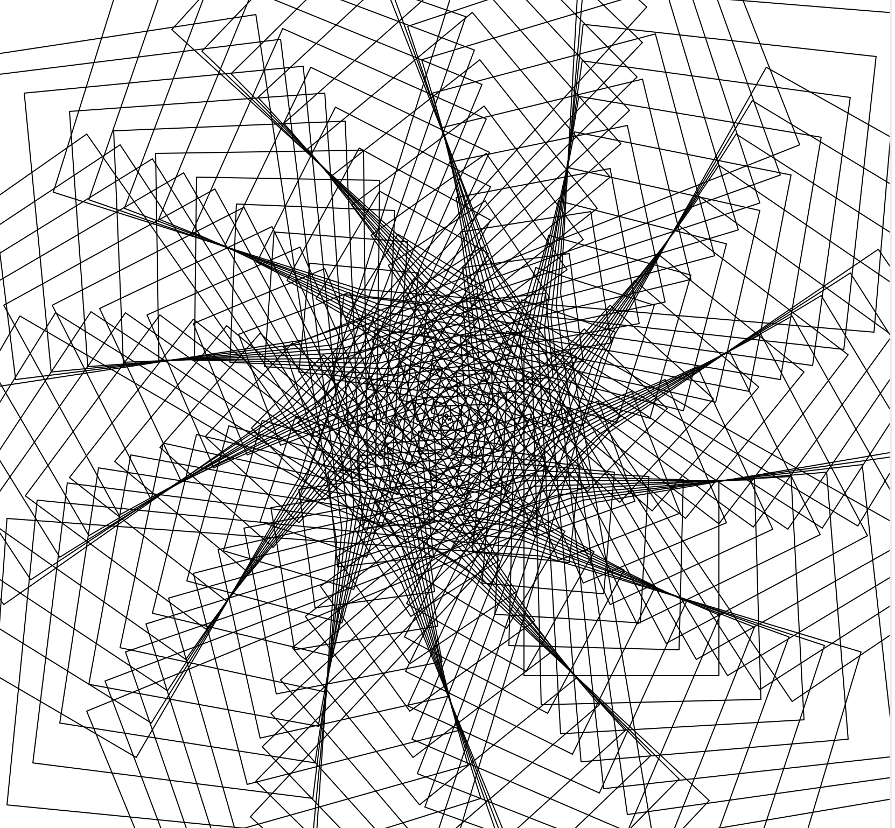

## The Code
```py
from turtle import *
import math


def main():
    phi = ( 1 + math.sqrt(5) ) / 2
    pi = math.pi
    t1 = Turtle()
    t1.hideturtle()
    t1.speed(0)
    angle = 3 #variant 
    angles = (360/angle)
    for x in range(1000):
        t1.forward(x)
        t1.right(angle*pi)
        for num in range(angles):
            t1.right(angle)
            t1.forward(x*phi)
    done()


if __name__ == '__main__':
    main()
```

## Notes
Basically move forwrad and turn right with ratios of phi and pi. Adjusting the angle variable yields a variety of results. 

## Results




