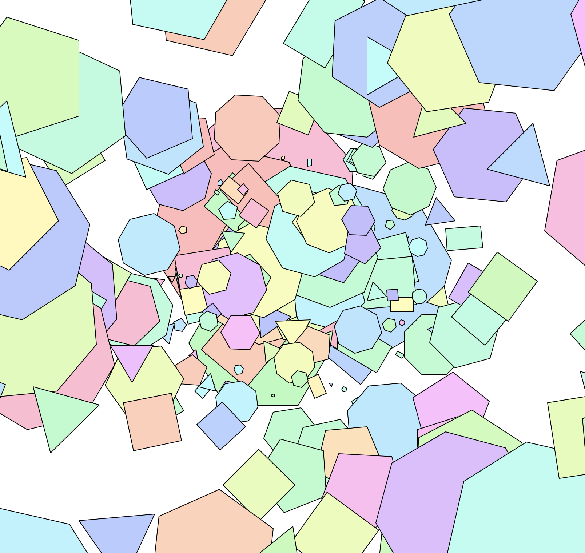
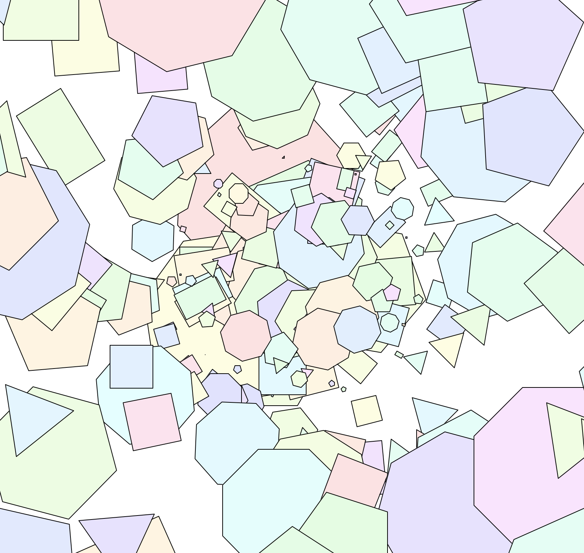
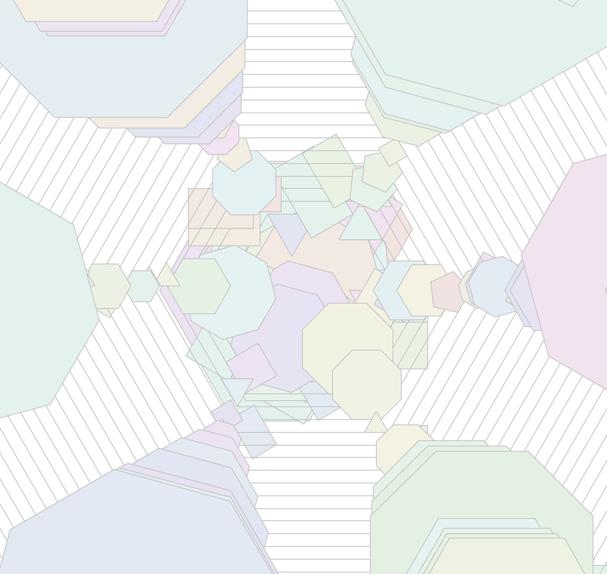
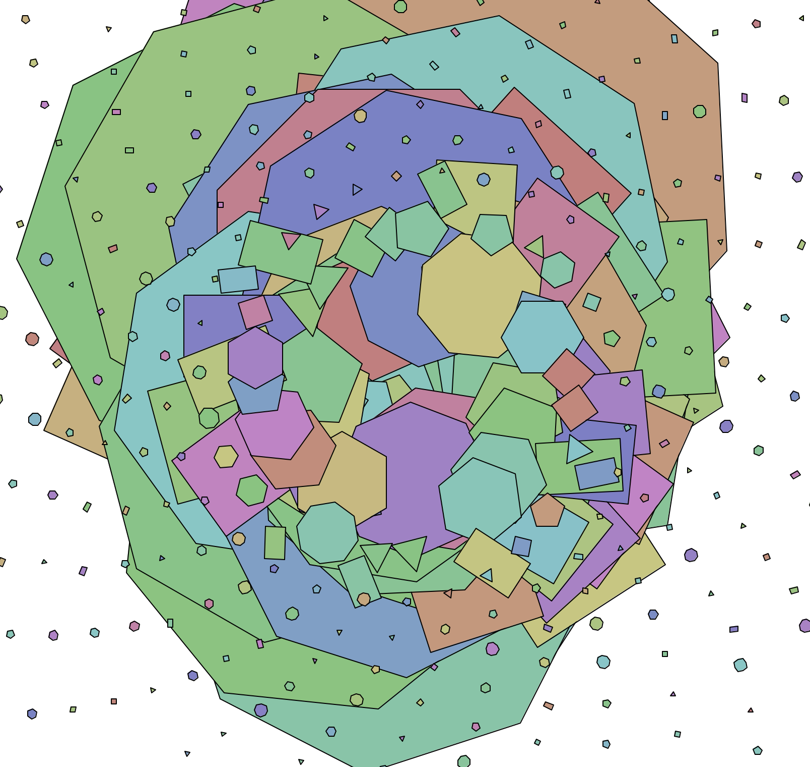
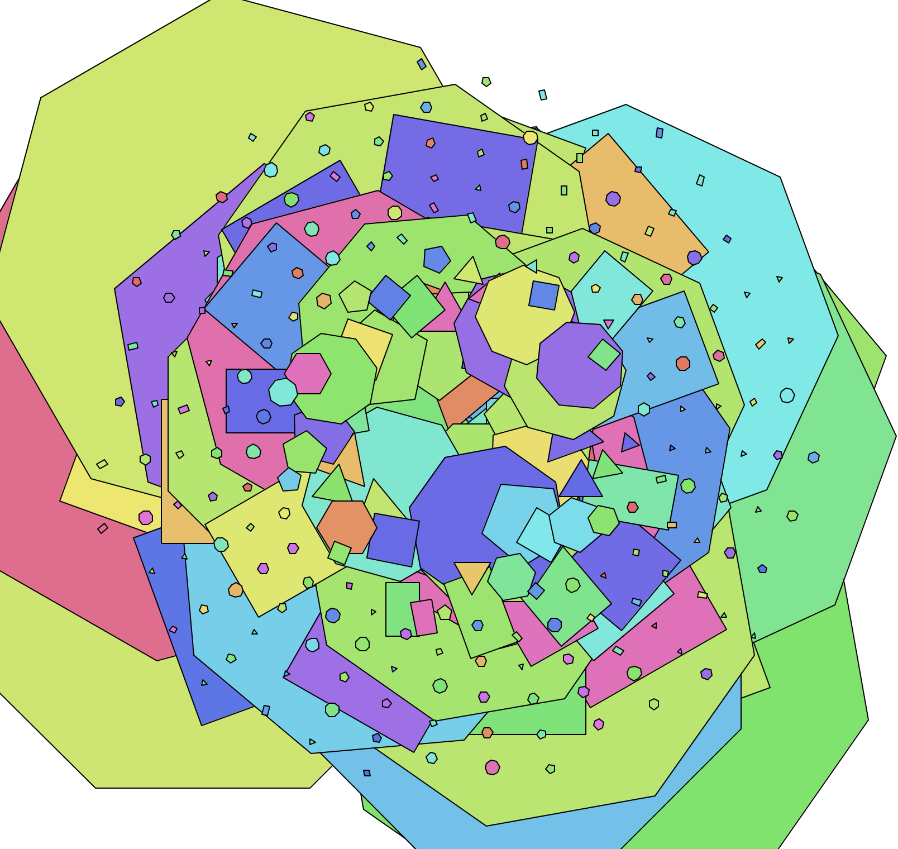

## The Code
```python
from turtle import *
import math
from random import *

t = Turtle()
phi = ( 1 + math.sqrt(5) ) / 2
pi = math.pi

def check_prime(num):
   if num > 1:
       for i in range(2, num):
           if (num % i) == 0:
               return False
       else:
           return True
           primes.append(num)

def golden_rect(size):
    t.right(90)
    t.forward(size)
    t.right(90)
    t.forward(size*phi)
    t.right(90)
    t.forward(size)
    t.right(90)
    t.forward(size*phi)

def long_rect(size):
    t.right(90)
    t.forward(size)
    t.right(90)
    t.forward(size*10)
    t.right(90)
    t.forward(size)
    t.right(90)
    t.forward(size*10)

def triangle(size):
    for side in range(3):
        t.forward(size)
        t.right(120)

def square(size):
    for x in range(4):
        t.forward(size)
        t.right(90)

def pentagon(size):
    for side in range(5):
        t.forward(size)
        t.right(72)

def hexagon(size):
    for side in range(6):
        t.forward(size)
        t.right(60)

def octagon(size):
    for side in range(8):
        t.forward(size)
        t.right(45)

def main():
    bgcolor('#e6e6e6')
    t.hideturtle()
    t.speed(0)
    colormode(255)
    prev = 0

    for x in range(1000):
        #path
        #t.up()
        t.color("#827e7e")
        t.forward(prev*phi*2) #path step size
        prev = x
        t.right(130) #path angle
        #t.down()
        path_dir = t.heading()

        #shape properties
        size = (100-x) if (100-x) >= 20 else (x - 60)#size
        #size = 10
        #t.right(x*pi*2) #rotation
        #choose R G B color
        brightness = 255
        saturation = 148
        hue = randint(saturation, brightness)
        hue_base = randint(1,2)
        if check_prime(x):
            if hue_base == 1:
                t.fillcolor((brightness, hue, saturation)) 
            else:
                t.fillcolor((brightness, saturation, hue)) 
        elif (x % 2) == 0: 
            if hue_base == 1:
                t.fillcolor((hue, brightness, saturation)) 
            else:
                t.fillcolor((saturation, brightness, hue)) 
        else: 
            if hue_base == 1:
                t.fillcolor((hue, saturation, brightness)) 
            else:
                t.fillcolor((saturation, hue, brightness))
        t.begin_fill()

        #draw shape
        rand_shape = randint(1,6)
        if rand_shape == 1:
            golden_rect(size)
        elif rand_shape == 2:
            triangle(size)
        elif rand_shape == 3:
            square(size)
        elif rand_shape == 4:
            pentagon(size)
        elif rand_shape == 5:
            hexagon(size)
        elif rand_shape == 6:
            octagon(size)          

        

        t.setheading(path_dir)
        t.end_fill()

    done()


if __name__ == '__main__':
    main()
```

## Notes
Random shape generation. This code uses a better color selection based on brightness, saturation and hue

## Results


<br />
<br />

<br />
<br />

<br />
<br />

<br />
<br />

