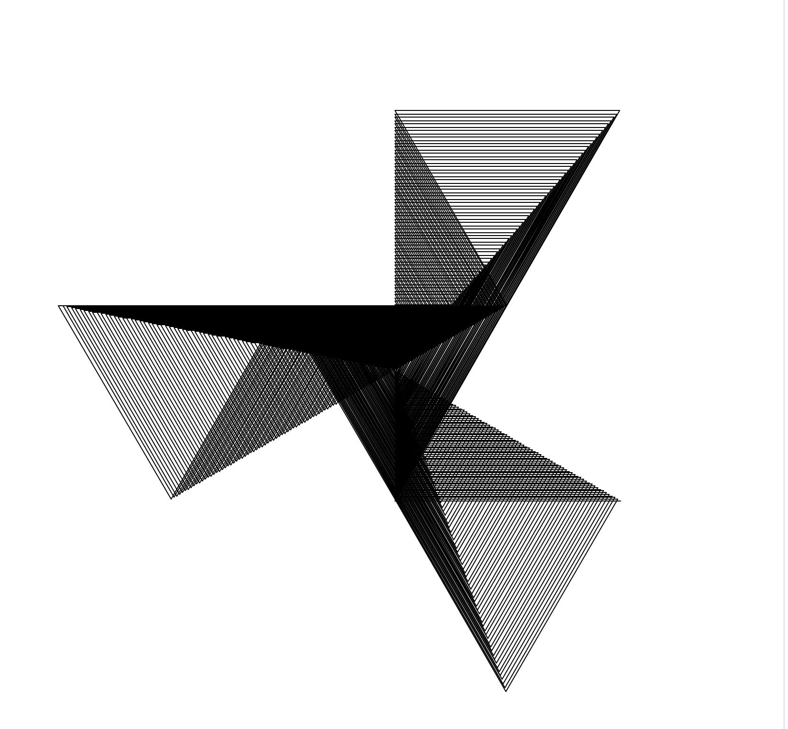
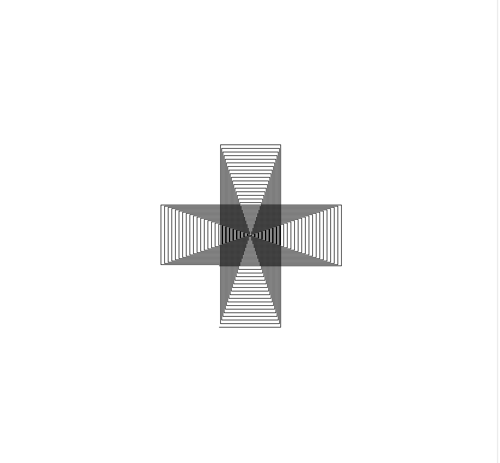
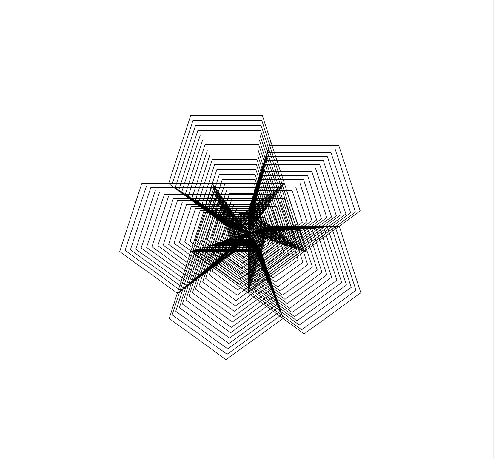
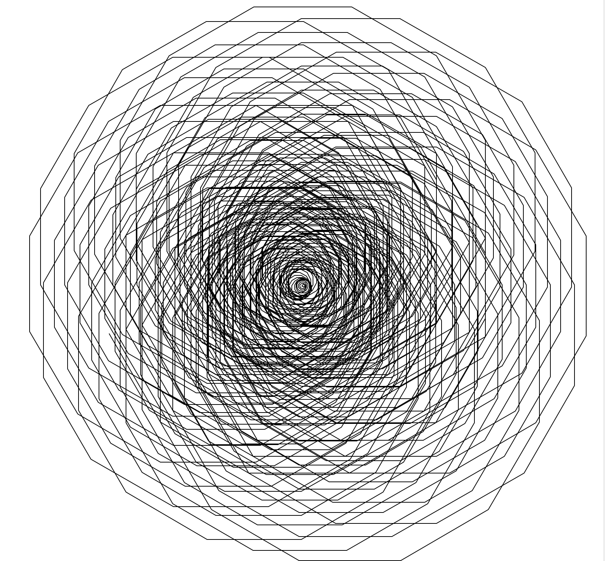
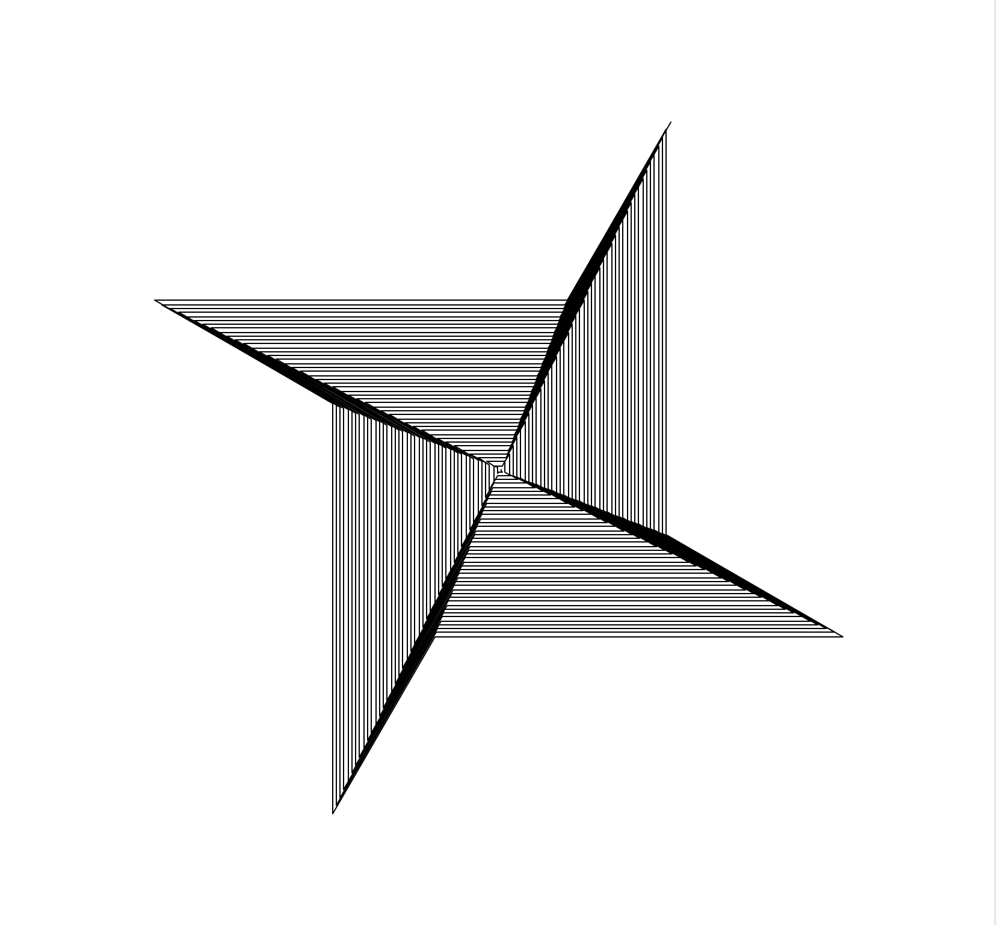
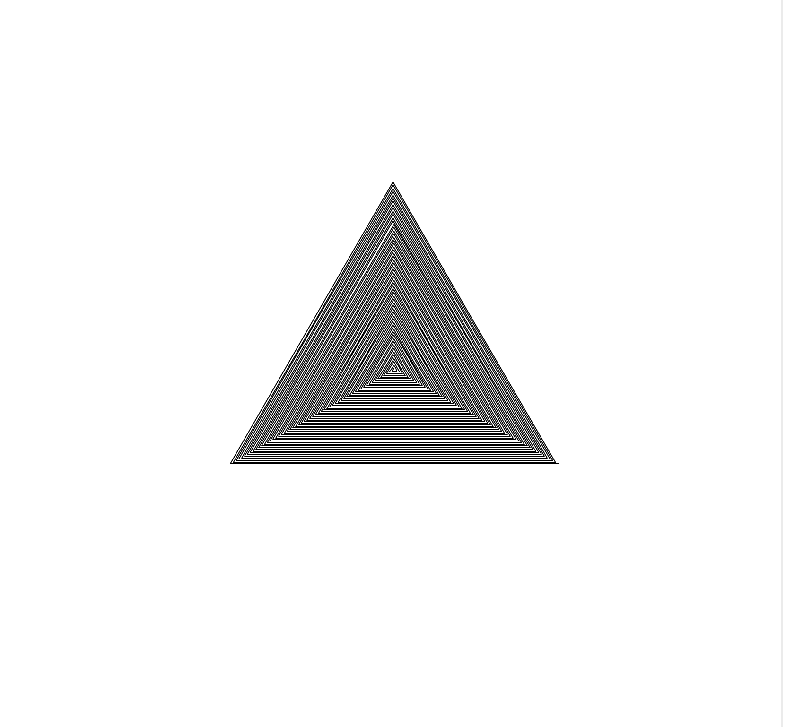
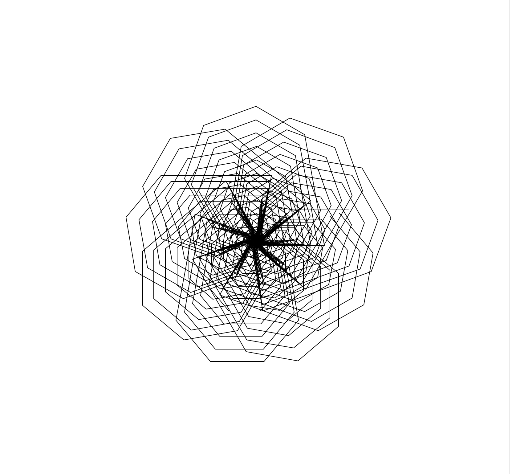

## The Code
```python
from turtle import *
import math


def main():
    phi = ( 1 + math.sqrt(5) ) / 2
    pi = math.pi
    t1 = Turtle()
    t1.hideturtle()
    t1.speed(0)
    angle = 50 #variant 
    angles = (360/angle)
    for x in range(1000):
        t1.forward(x)
        t1.right(angle)
        for num in range(angles):
            t1.right(angle)
            t1.forward(x)
    done()


if __name__ == '__main__':
    main()
```

## Notes
Similar to program 1 but without using phi. Angle is still the main variant.

## Results


<br />
<br />

<br />
<br />

<br />
<br />

<br />
<br />

<br />
<br />

<br />
<br />

