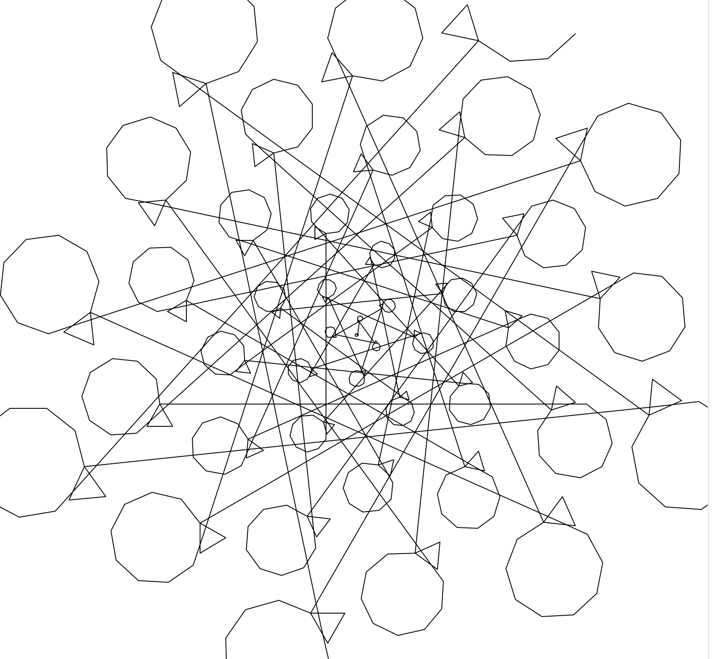

## The Code
```python
from turtle import *
import math


def main():
    phi = ( 1 + math.sqrt(5) ) / 2
    pi = math.pi
    t1 = Turtle()
    t1.hideturtle()
    t1.speed(0)
    rangle = 150 #variant 
    rangles = (360/rangle)
    langle = int(rangle/phi) #variant
    langles = (360/langle) 
    prev = 1
    for x in range(1000):
        t1.penup()
        t1.forward(prev)
        t1.right(rangle)
        t1.pendown()
        prev = x * phi * 10 #variant
        for num in range(rangles):
            t1.right(rangle)
            t1.forward(x)
        t1.penup()
        t1.forward(x*phi*pi)
        t1.pendown()
        for num in range(langles):
            t1.left(langle)
            t1.forward(x*phi*2)
    done()


if __name__ == '__main__':
    main()
```

## Notes
This one has a couple more variants to play with. At each new two shapes are created. You can also comment out/in pen up and down to get a cleaner look.

## Results


<br />
<br />

<br />
<br />

<br />
<br />

<br />
<br />

<br />
<br />

<br />
<br />

<br />
<br />

<br />
<br />

<br />
<br />

<br />
<br />

<br />
<br />

<br />
<br />

