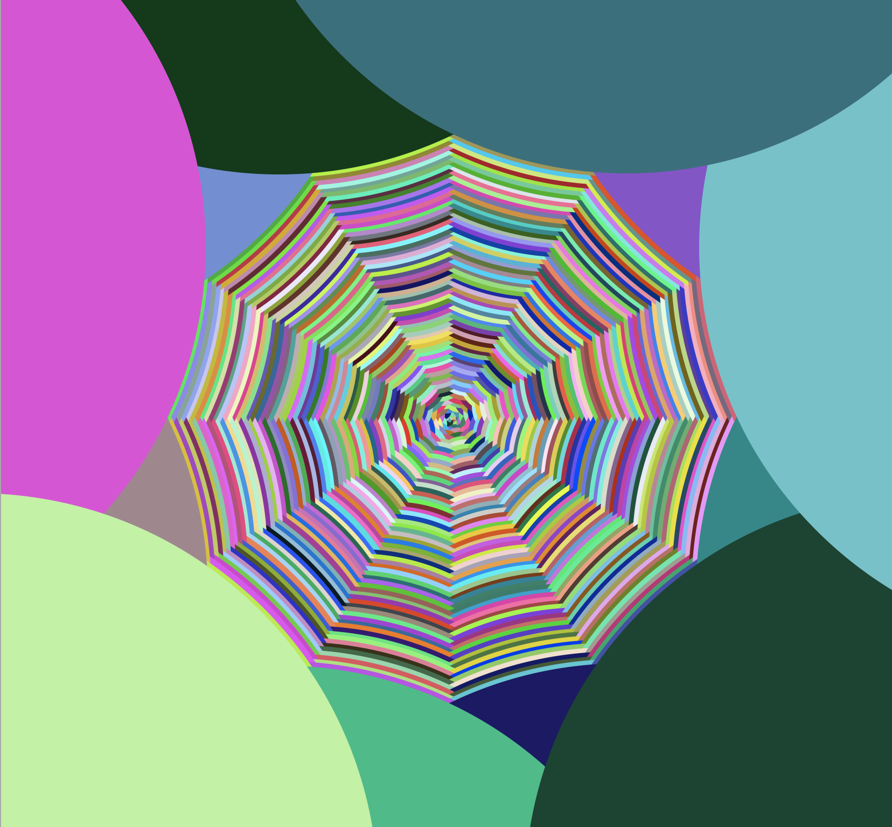
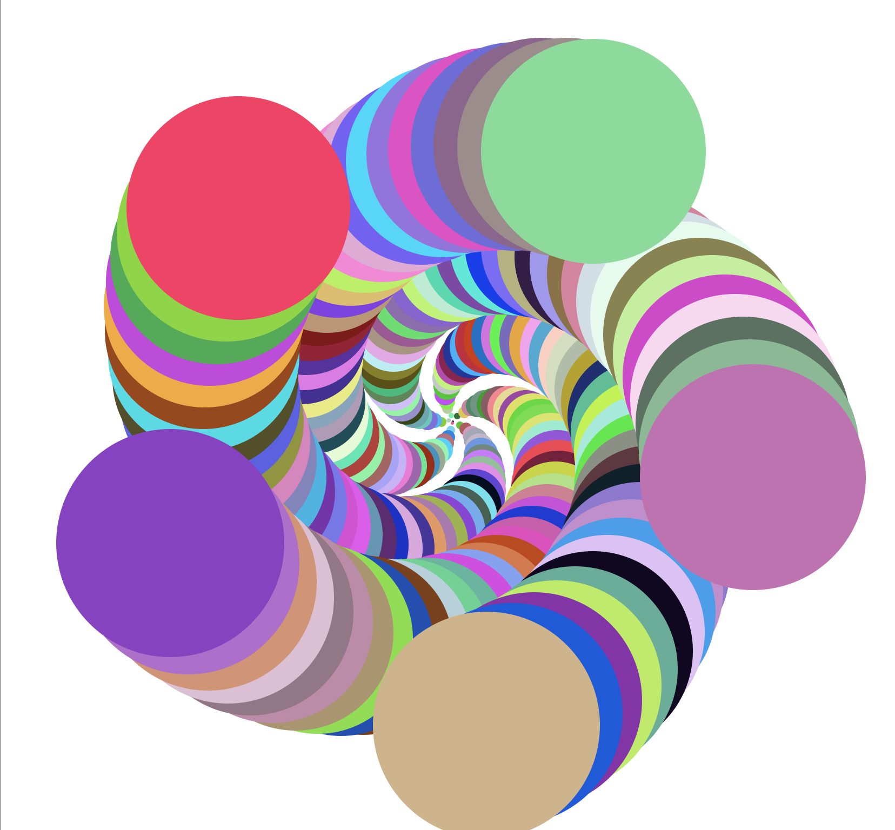
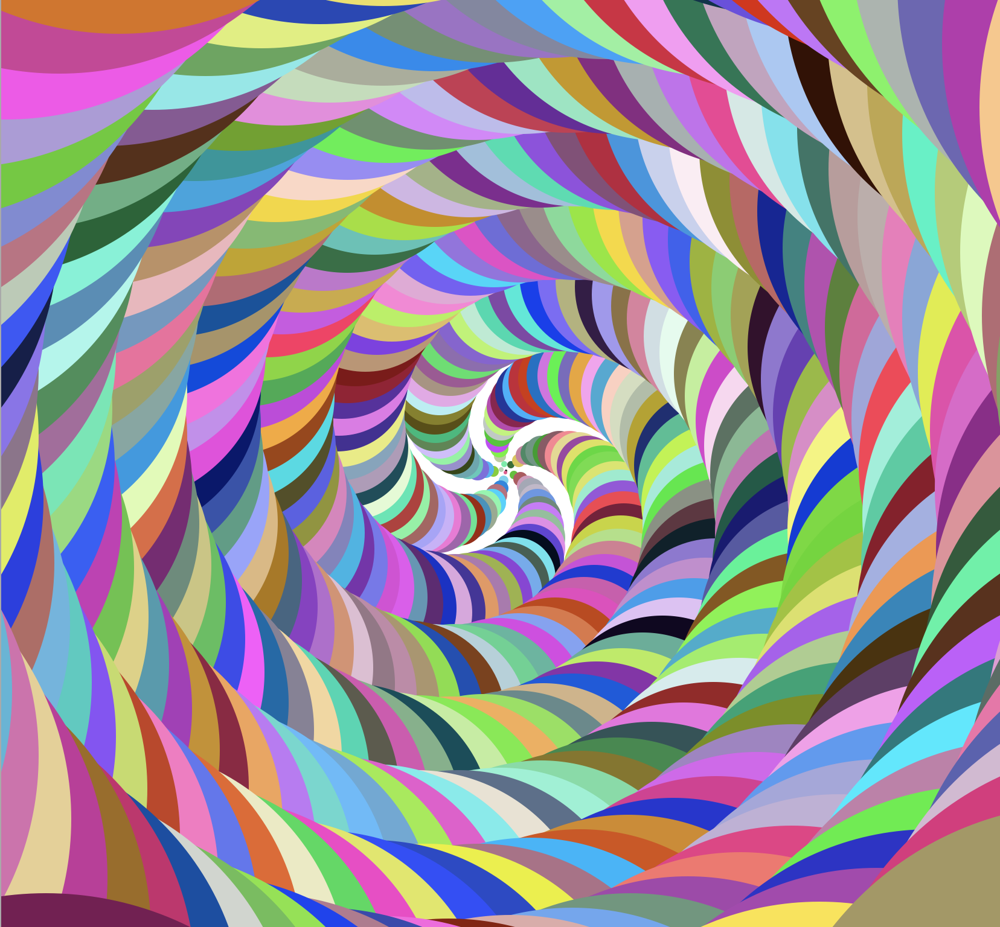
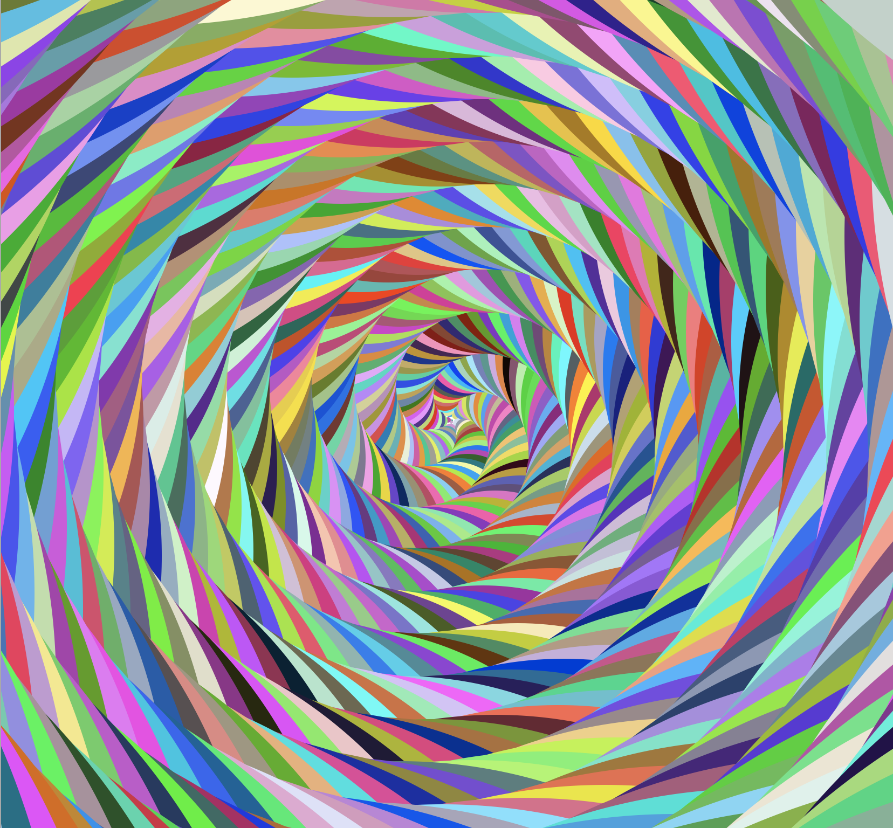
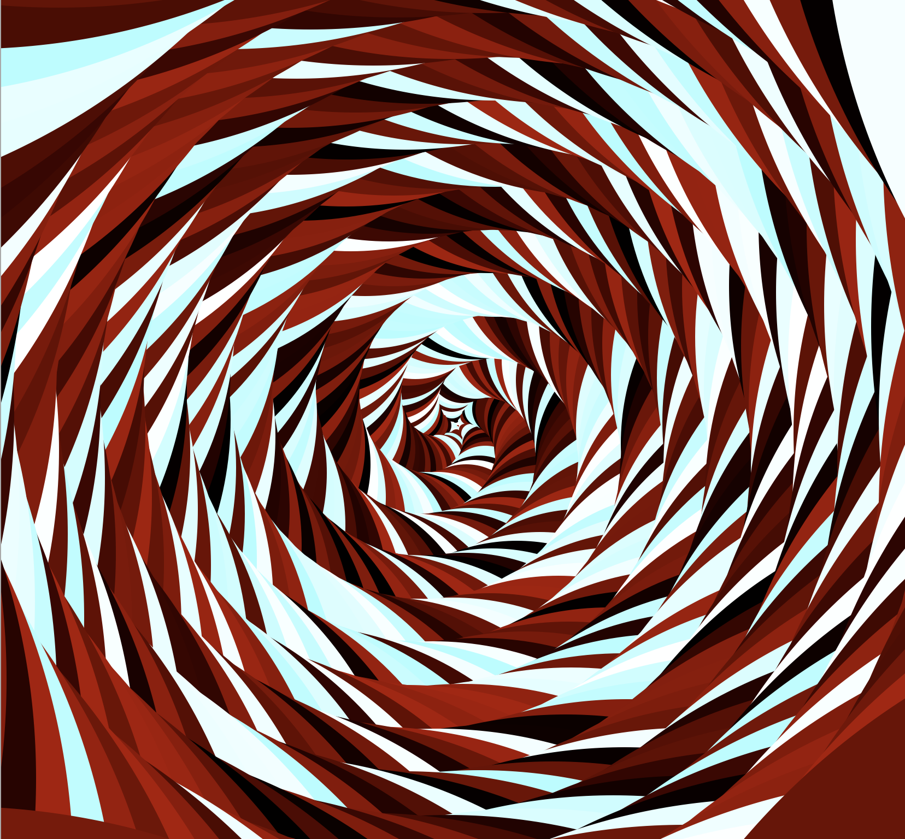
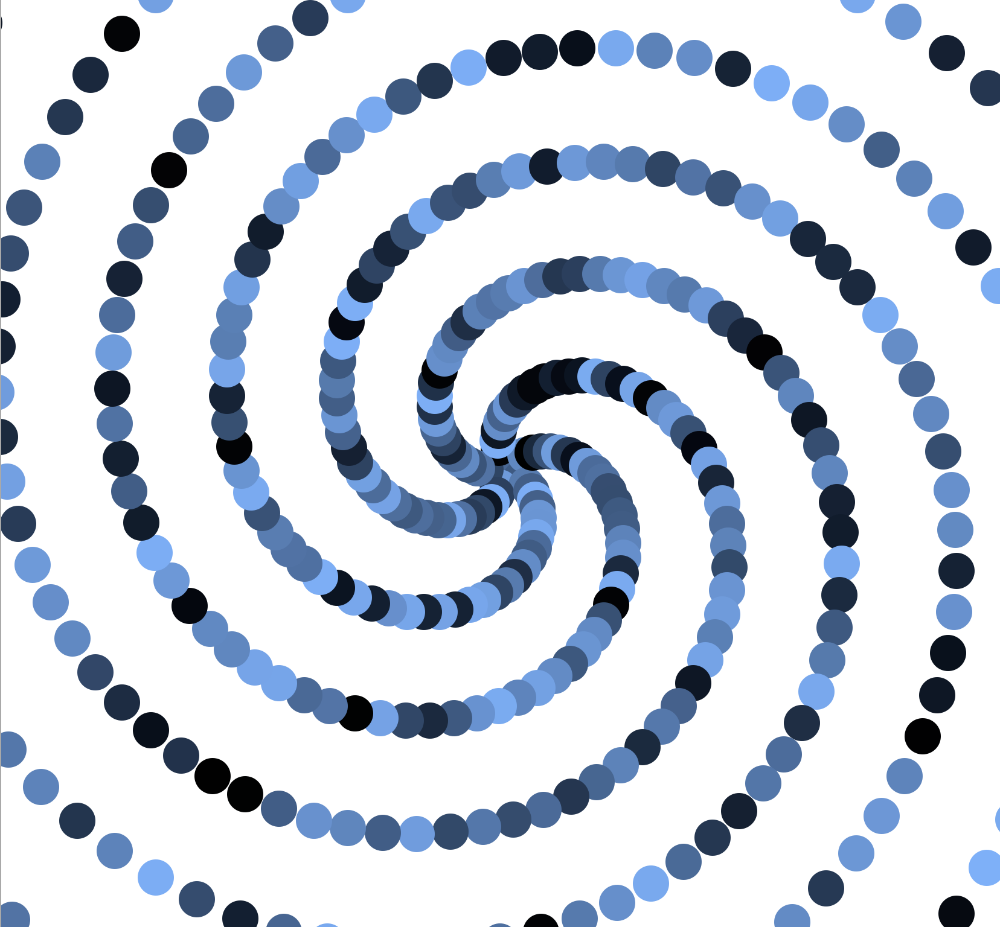
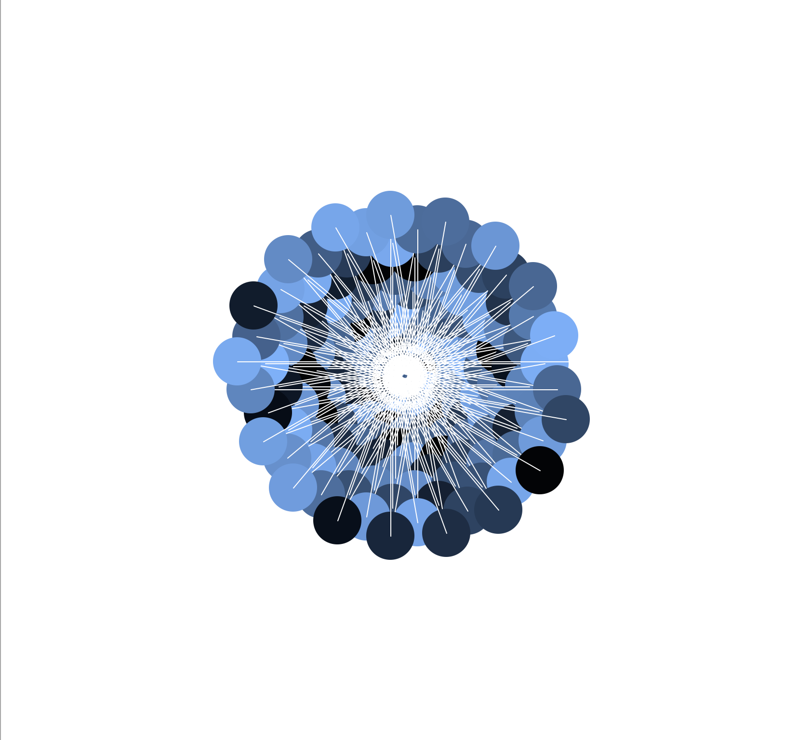
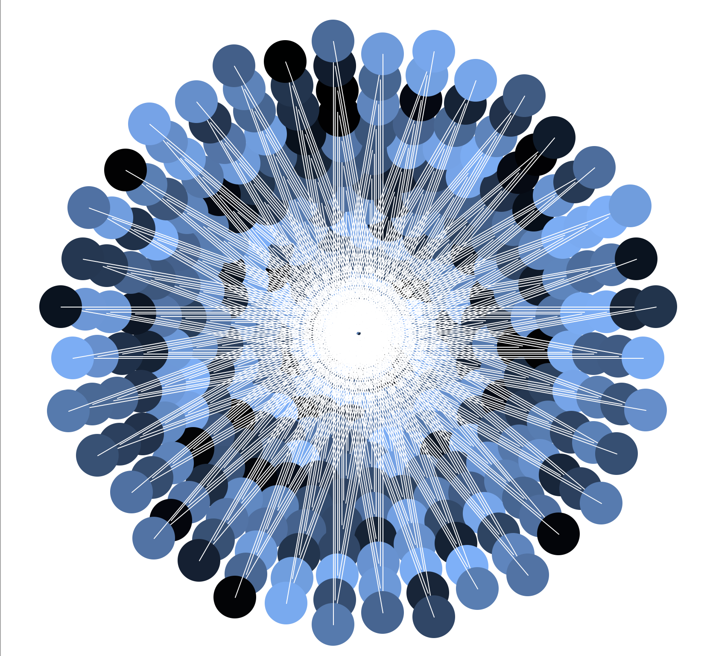
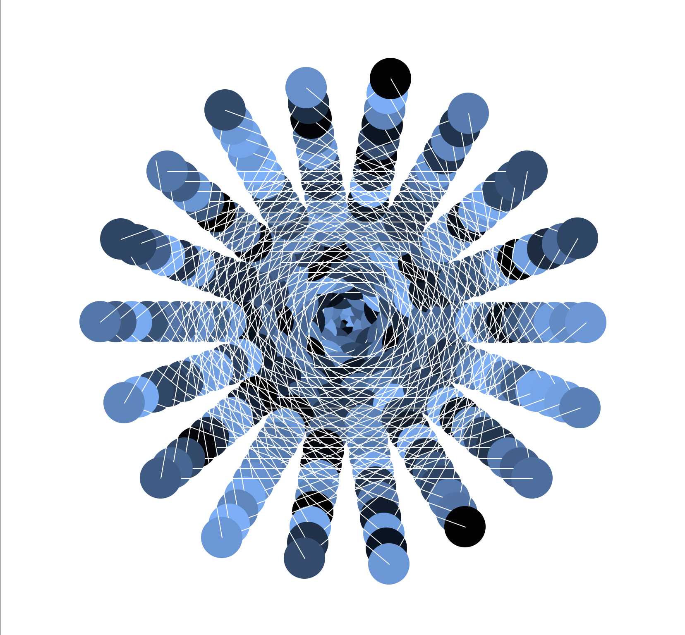

## The Code
```python
from turtle import *
import math
import random


def main():
    phi = ( 1 + math.sqrt(5) ) / 2
    pi = math.pi
    t1 = Turtle()
    t1.hideturtle()
    t1.speed(0)
    prev = 0
    for x in range(1000):
        c = random.random()
        R = float(c/phi/phi) #variant
        B = float(c/phi) #variant
        G = float(c) #variant

        t1.dot(50, (R,B,G))
        t1.color("white")
        t1.forward(prev*phi) #variant
        t1.right(150)
        prev = x

    done()


if __name__ == '__main__':
    main()
```

## Notes
Color schemes can be created by playing with ratios of RBG. 

## Results










