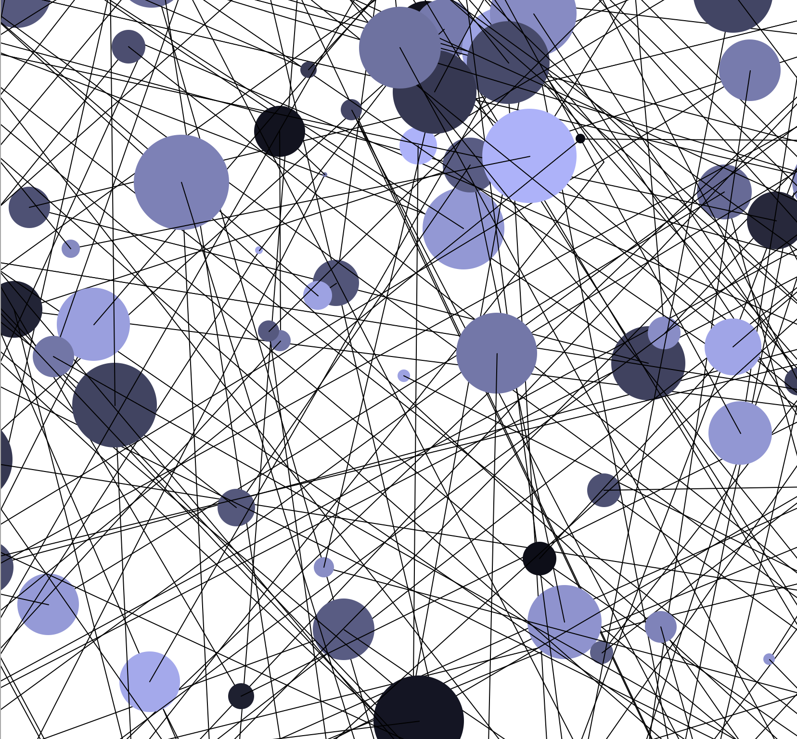
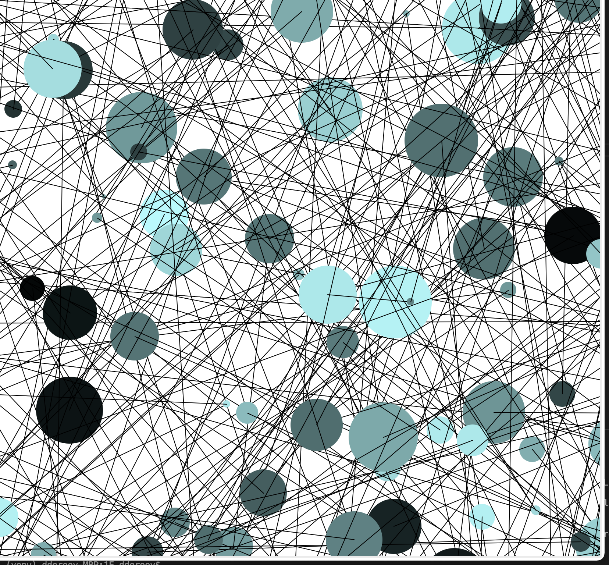
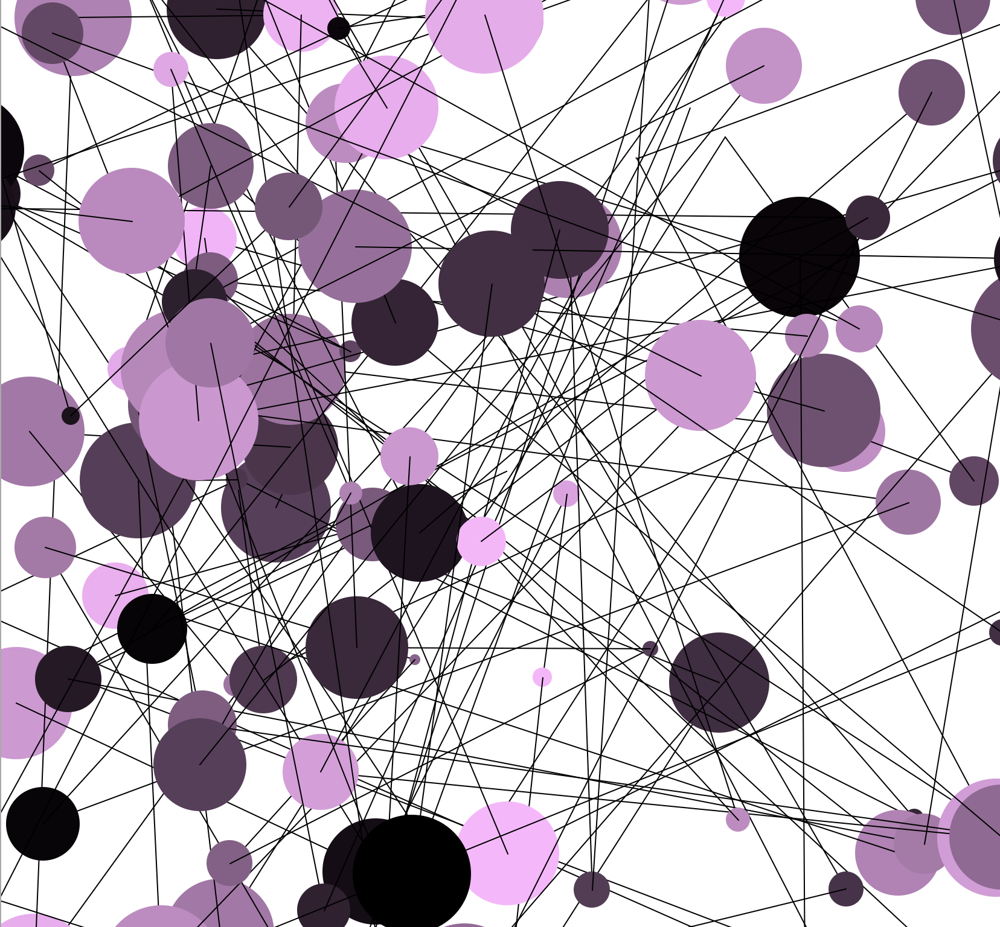
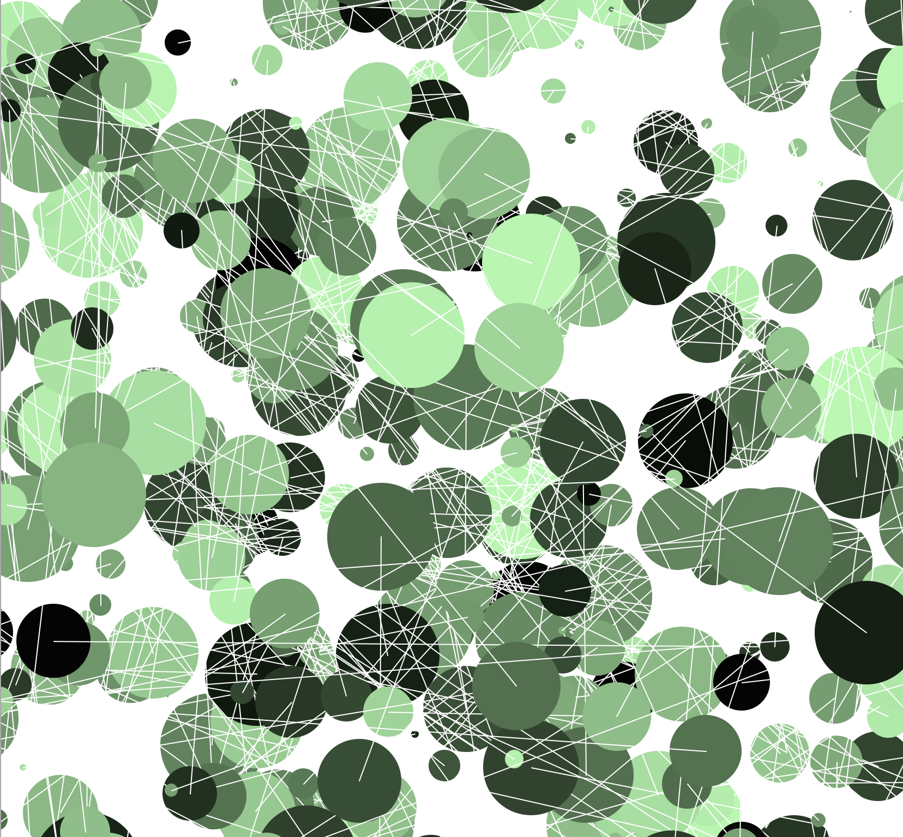
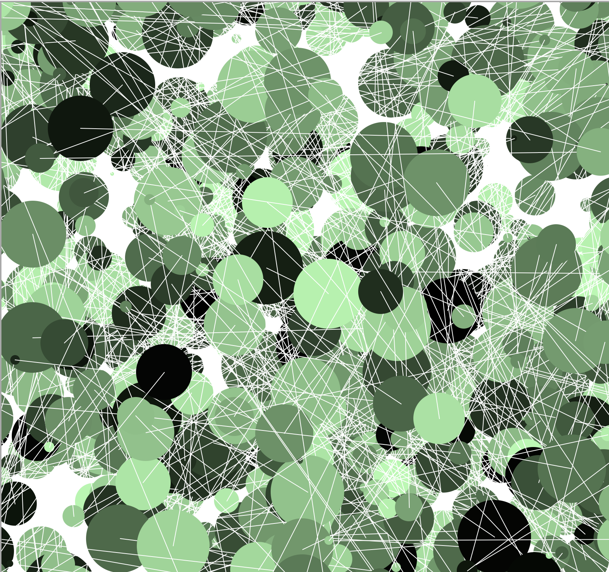
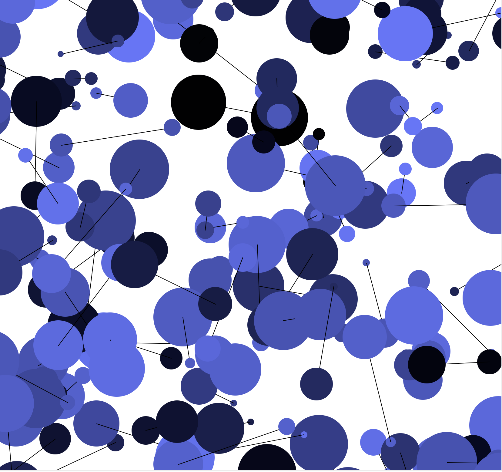

## The Code
```python
from turtle import *
import math
import random


def main():
    phi = ( 1 + math.sqrt(5) ) / 2
    pi = math.pi
    t1 = Turtle()
    t1.hideturtle()
    t1.speed(0)
    prev = 0
    c = random.random()
    R = float(c/3) 
    B = float(c/3)
    G = float(c)
    t1.dot(random.randint(0, 100), (R,B,G))
    #t1.color("white")
    for x in range(1000):
        t1.penup()
        x = random.randint(-500, 500)
        y = random.randint(-500, 500)
        t1.goto(x, y)
        t1.pendown()

        c = random.random()
        R = float(c/3)
        B = float(c/3)
        G = float(c)
        t1.dot(random.randint(10, 100), (R,B,G))
        t1.right(random.randint(0, 360))
        t1.forward(random.randint(0,200))
        t1.dot(random.randint(10, 100), (R,B,G))

    done()


if __name__ == '__main__':
    main()
```

## Notes
This program explores randomness with both color and position.

## Results


<br />
<br />

<br />
<br />

<br />
<br />

<br />
<br />

<br />
<br />

