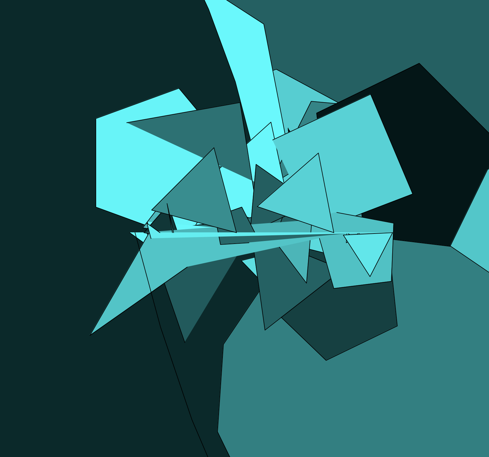
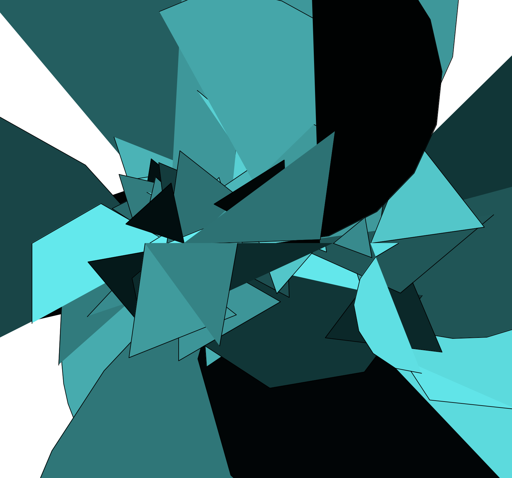
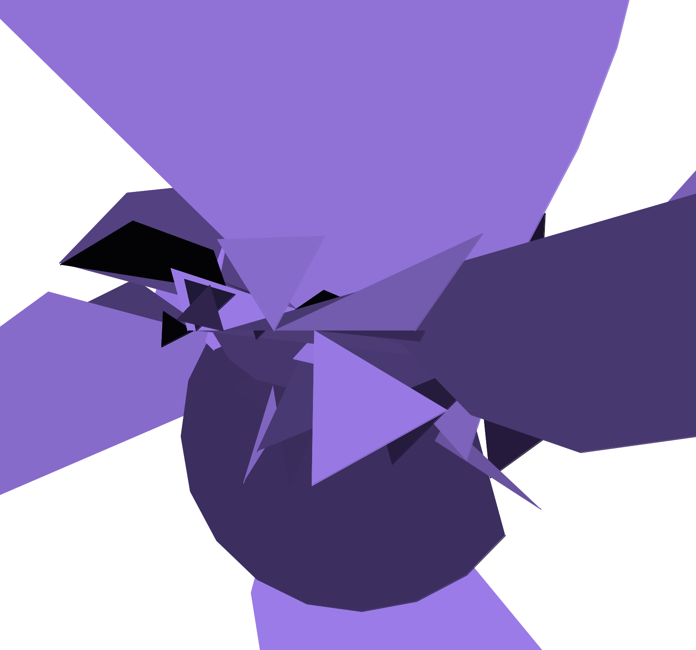
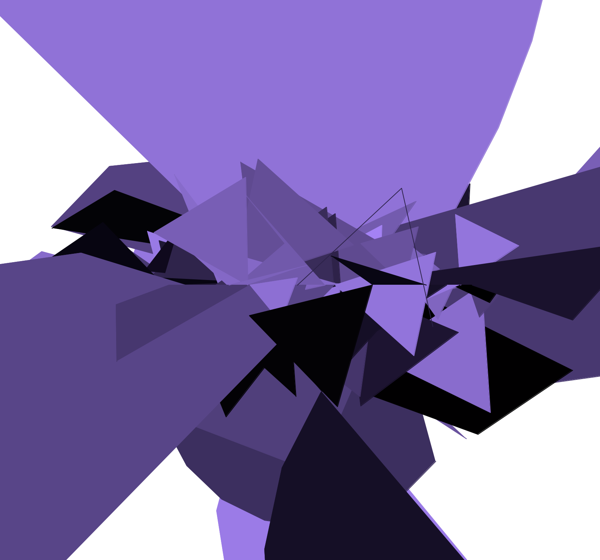
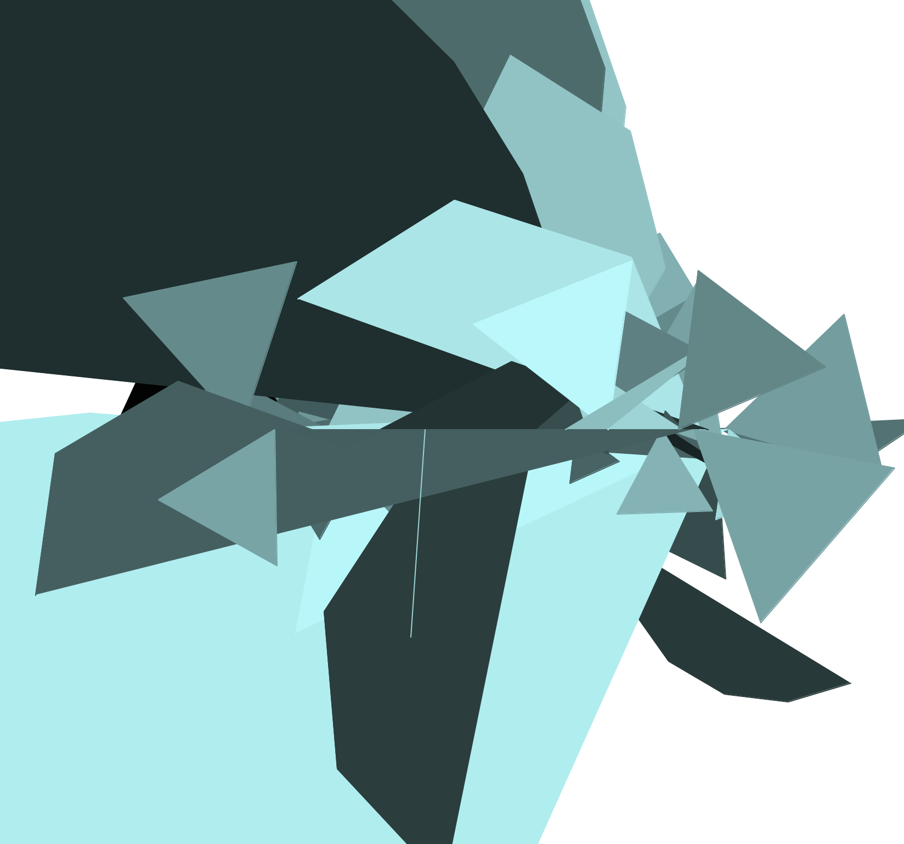

## The Code
```python
from turtle import *
import math
import random


def main():
    phi = ( 1 + math.sqrt(5) ) / 2
    pi = math.pi
    t1 = Turtle()
    t1.hideturtle()
    t1.speed(0)

    for x in range(1000):
        size = random.randint(10, 200)
        xpos = random.randint(-200, 250)
        ypos = random.randint(-80, 80)
        c = random.random()
        R = float(c/100)
        B = float(c)
        G = float(c/100)
        t1.fillcolor(R, B, G)
        t1.begin_fill()
        t1.up()
        t1.goto(xpos, 0)
        t1.down()
        if (x % 2) == 0:
            t1.right(120)
            t1.forward(size)
            t1.right(120)
            t1.forward(size)
            t1.right(120)
            t1.forward(size)
        else:
            angle = random.randint(5, 180)
            for turn in range(180/angle):
                t1.left(angle)
                t1.forward(size)
        t1.end_fill()

    done()


if __name__ == '__main__':
    main()
```

## Notes
This program generates random shapes along random points of the x axis

## Results


<br />
<br />

<br />
<br />

<br />
<br />

<br />
<br />
