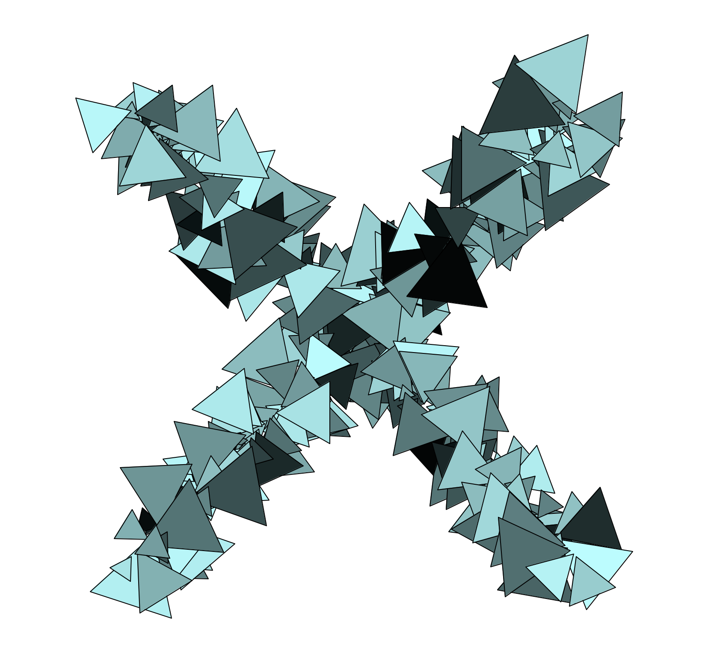
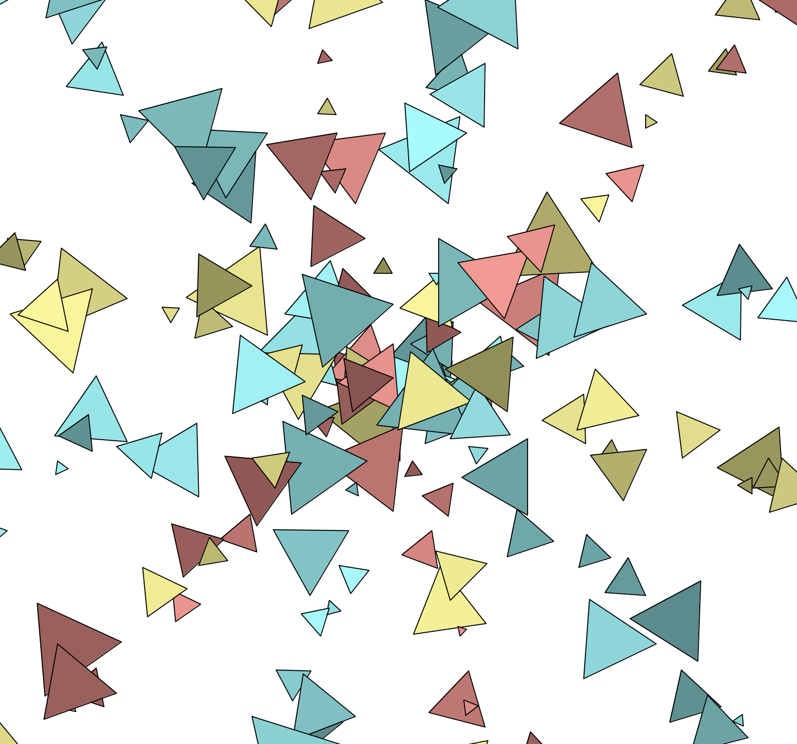

## The Code
```python
from turtle import *
import math
import random

def check_prime(num):
   if num > 1:
       for i in range(2, num):
           if (num % i) == 0:
               return False
       else:
           return True
           primes.append(num)

def main():
    phi = ( 1 + math.sqrt(5) ) / 2
    pi = math.pi
    t = Turtle()
    t.hideturtle()
    t.speed(0)
    colormode(255)
    prev = 0

    for x in range(1000):
        #path
        t.up()
        t.forward(prev*phi)
        prev = x
        t.right(60)
        t.down()

        #shape properties
        size = random.randint(50, 50)
        col = random.randint(120, 255)
        if check_prime(x):
            t.fillcolor((col, col, col)) #rgb
        elif (x % 2) == 0:
            t.fillcolor((col/phi, col, col)) #rgb
        else:
            t.fillcolor((col/phi/phi, col, col)) #rgb
        t.begin_fill()

        #draw shape
        path_dir = t.heading()
        #t.right(random.randint(5, 360))
        poly_angle = 60
        for angle in range(360/poly_angle):
            t.right(poly_angle)
            t.forward(size)

        t.setheading(path_dir)
        t.end_fill()

    done()


if __name__ == '__main__':
    main()
```

## Notes
This program explores the use of colors more and shape generation

## Results


<br />
<br />

<br />
<br />

<br />
<br />

<br />
<br />

<br />
<br />
